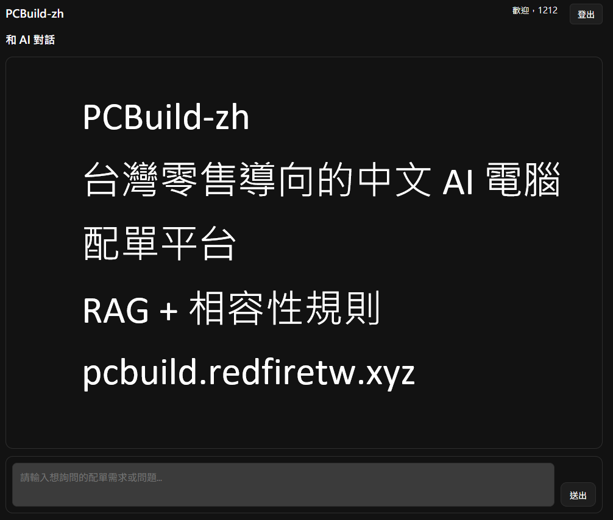

# PCBuild-zh

台灣零售導向的中文 AI 電腦配單平台，核心以 RAG、相容性規則與可追溯資料管線產生配單建議。

這個專案的重點不是單純聊天介面，而是把「需求理解 -> 候選檢索 -> 規則把關 -> 中文回答」整理成可維護、可驗收、可回放的後端主線。

正式站點：`https://pcbuild.redfiretw.xyz/`  
最新版本：[`v1.0.0`](../../releases/latest)

## 目前狀態

目前版本定位為維護期基線（`v1.0.0`）：

- 已完成 FastAPI 後端、靜態前端、帳號驗證與 chat 主線整合。
- crawler / catalog 與 chat / AI 皆已有可追溯的 staging、snapshot 與驗收流程。
- 正式 AI 主線以 OpenAI-compatible provider 為基準，provider / model 採 env-only 切換。
- 推薦品質、budget 利用率與部分相容性規則仍持續校正，整體定位仍是可維護 MVP。

## 快速導覽

- [Demo](https://pcbuild.redfiretw.xyz/)
- [Latest Release](../../releases/latest)
- [Docs Index](docs/README.md)
- [Project Architecture](docs/project-architecture.md)
- [Smoke Test](docs/SMOKE_TEST.md)

## 核心功能

- 以台灣零售零件資料為基礎，提供中文 AI 配單建議。
- 透過 retrieval、context pack 與相容性規則降低回答失真。
- 建立 crawler / catalog 資料管線，支援 staging、merge 與 publication pointer。
- 保留 request、snapshot、context pack、staging / quarantine 等 trace artifact。
- 提供 smoke test、provider health、release check 等維運驗收入口。

## 專案架構總覽

- `web/`：靜態前端頁面與 chat / auth 相關資產。
- `backend/api/`、`backend/core/`：FastAPI route、app factory、settings、middleware 與 logging。
- `backend/services/chat/`：AI chat 主線，包含 retrieval、context pack、gate / DQ、snapshot 與 staging。
- `backend/services/crawler/`、`backend/services/catalog/`：零件抓取、資料治理、catalog merge 與查詢。
- `backend/tools/`、`observability/`：ops CLI 與觀測相關設定。

完整分層與資料流請見 [docs/project-architecture.md](docs/project-architecture.md)。

## 作品集定位

PCBuild-zh 除了展示台灣零售導向的中文 AI 電腦配單能力，也作為我以 AI 輔助完成實際專案的代表作品。我主導需求收斂、系統架構規劃、後端流程設計、部署與維運整理；AI 在開發過程中主要用於協助重構、測試補強、文件整理與迭代驗收，而不是取代核心設計與最終決策。

- 以 RAG 與相容性規則降低配單建議的幻覺與不一致。
- 將既有後端與維運文件收斂為可維護的交付基線。
- 把 AI 納入實際開發流程，而不只停留在概念驗證。

## License

[MIT](LICENSE)
